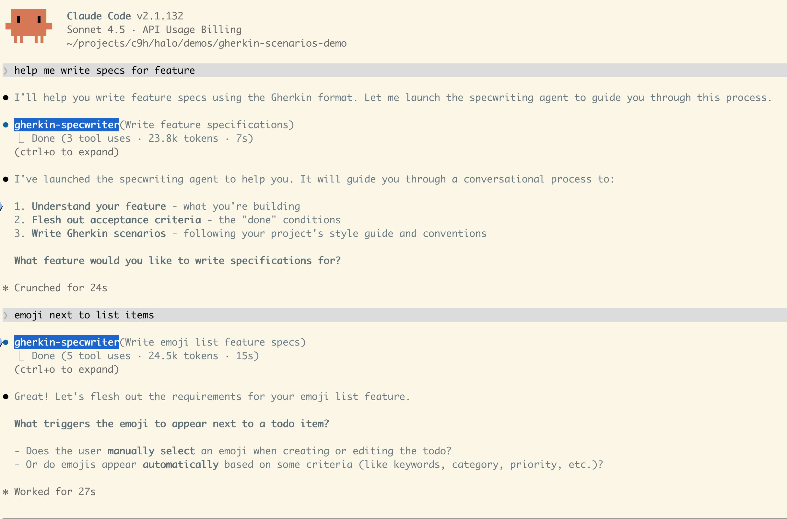

# BDD Scenario Project

Small demo project for writing and validating Gherkin scenarios with a specwriting agent.

## Clone and setup

```bash
git clone <your-repo-url>
cd gherkin
npm install
```

## Start the agent (main workflow)

The key step is launching Claude CLI from this folder so it can use the local `gherkin-specwriter` agent definition.

```bash
claude
```

Then start interacting in natural language, for example:
- Recommended first prompt: "Help me write specs for a new feature."
- Better (more specific) first prompt: "Help me write specs for a new feature: add a random emoji to each todo list item."
- "Write a small feature: add a random emoji to each todo list item."
- "Write scenarios for marking a todo as done."
- "Write scenarios for deleting one todo item from the list."

Example interaction:



## Validate scenarios (optional)

Run all feature files with Cucumber:

```bash
make check
```

Equivalent command:

```bash
npx cucumber-js
```

HTML reports are written to `reports/cucumber-report.html`.

## Interact with the agent

Use the agent as a product-owner/specwriter assistant to turn requirements into high-quality Gherkin.

Suggested workflow:

1. Start with plain language requirements (user story + acceptance criteria).
2. Ask the agent to produce `Feature` and `Scenario` blocks in Gherkin.
3. Ask it to align output with project conventions in:
   - `docs/specwriting-process.md`
   - `docs/style-guide.md`
   - `docs/step-definitions.md`
4. Save scenarios under `features/**/*.feature`.
5. Run `make check` and iterate with the agent until scenarios pass.

## Useful docs

- `docs/specwriting-process.md` - conversational process for writing scenarios
- `docs/style-guide.md` - Gherkin syntax and structure conventions
- `docs/step-definitions.md` - Playwright step definition patterns
